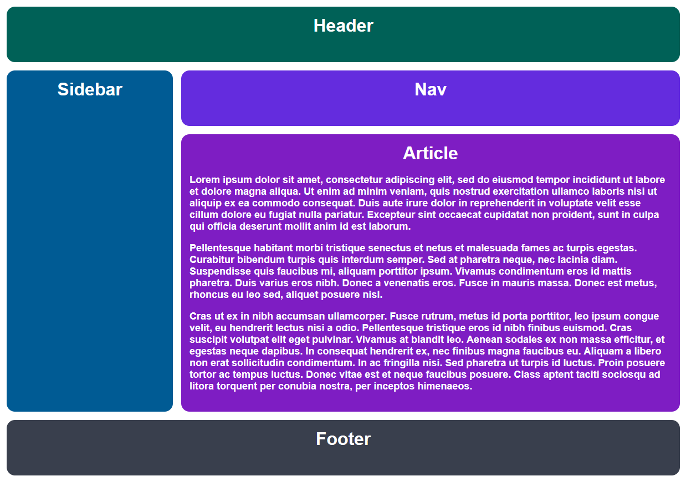

Creating the "Holy Grail Layout" with Grid.

> This was easily created with Chrome Dev Tools. 

If you open up developer tools in Chrome, you can navigate to the Layout pane and find the Grid overlay display settings. Make sure that show line numbers are enabled. Select the correct element from the Grid overlays You should now see an overlay of the grid lines.

## Desired outcome
